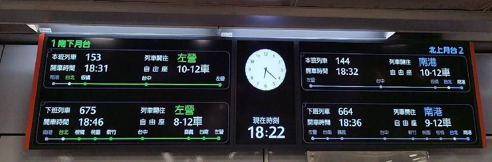

# thsr-train-displayer

## 高鐵站顯示畫面

實作出高鐵站的顯示螢幕，如下圖：



可選擇所在車站來改變顯示內容，
會隨時間變化目前即將要抵達的南下/北上各兩輛列車

**API:** https://ptx.transportdata.tw/MOTC/v2?urls.primaryName=%E8%BB%8C%E9%81%93V2#/THSR

---

- **template of:** vite + react
- **tailwindcss:** v3.x

## Started

```bash
yarn
# or `npm install`
```

---

## Develop

```bash
yarn dev
# or `npm run dev`
```

---

## Build

```bash
yarn build
# or `npm run build`
```

---

<p align="center">

</p>
